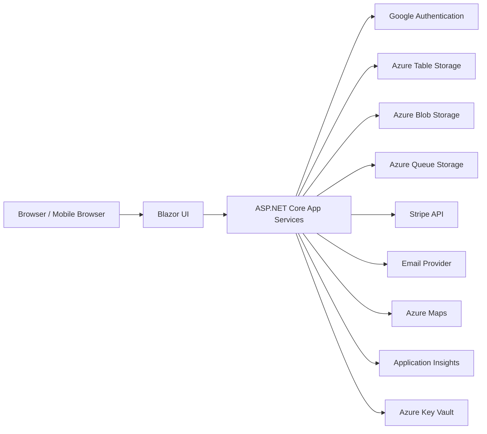

# Architecture Document

## 1. Architecture Goals

The application is a multi-tenant SaaS platform for pool cleaning and landscaping companies. It must be secure, mobile-friendly, tenant-isolated, Azure-hosted, and built with Blazor. Data persistence must use Azure Storage.

Primary goals:

- Support small businesses with simple operational workflows.
- Keep company data isolated by tenant.
- Use Google Authentication for identity.
- Use Azure Storage as the system of record.
- Integrate Stripe for payments.
- Support responsive desktop and mobile UI.
- Keep the MVP straightforward while leaving room for maps, photos, offline work, and richer billing.

## 2. Recommended Azure Architecture

Recommended services:

- Azure App Service: Hosts the Blazor application and backend API.
- Blazor Web App: UI built with Blazor. Use server-side rendering plus interactive components, or Blazor WebAssembly with an ASP.NET Core API depending on project preference.
- ASP.NET Core: Backend application services, authorization, API endpoints, background job entry points, and integrations.
- Azure Table Storage: Main structured entity persistence.
- Azure Blob Storage: File storage for logos, attachments, future photos, generated exports, and email assets.
- Azure Queue Storage: Background work queue for email, schedule generation, route optimization, and webhook processing.
- Azure Key Vault: Secrets for Google auth, Stripe, email provider, maps provider, and storage connection strings.
- Azure App Configuration: Non-secret runtime configuration and feature flags.
- Azure Application Insights: Telemetry, logs, traces, failures, and performance monitoring.
- Azure Communication Services: Email delivery for the current implementation.
- Azure Maps: Geocoding, maps, and route optimization.
- Stripe: Payments, invoices, customers, payment links, payment intents, and webhooks.

## 3. High-Level Components

## 4. Application Layers

### 4.1 UI Layer

Technology:

- Blazor.
- Responsive layouts for desktop and mobile.
- Role-aware navigation.
- Form validation using shared request models or view models.

Responsibilities:

- Render persona-specific dashboards.
- Submit commands to application services.
- Display filtered tenant data.
- Support mobile field workflows.
- Avoid exposing hidden authorization assumptions in the UI only; backend must enforce authorization.

### 4.2 API and Application Service Layer

Technology:

- ASP.NET Core.
- Minimal APIs or controllers.
- Dependency-injected services.

Responsibilities:

- Authentication callback handling.
- Authorization and tenant membership validation.
- Business workflows.
- Stripe integration.
- Email job creation.
- Schedule generation.
- Report generation.
- Route optimization orchestration.

Suggested services:

- `IdentityService`
- `AuthorizationService`
- `CompanyService`
- `CompanyTypeService`
- `MembershipService`
- `ClientService`
- `ClientTypeService`
- `ServiceCatalogService`
- `MaterialCatalogService`
- `ScheduleService`
- `VisitService`
- `RouteService`
- `NotificationService`
- `BillingService`
- `ReportService`
- `AuditService`

### 4.3 Storage Access Layer

Technology:

- Azure.Data.Tables for Table Storage.
- Azure.Storage.Blobs for Blob Storage.
- Azure.Storage.Queues for Queue Storage.

Responsibilities:

- Encapsulate partition key and row key design.
- Provide query methods that avoid full table scans.
- Normalize table entity serialization.
- Support optimistic concurrency through ETags.
- Provide idempotency helpers for external webhooks and queued jobs.

### 4.4 Background Worker Layer

Options:

- Use a hosted background service inside the App Service for MVP.
- Use Azure Functions for a more scalable worker model.

Responsibilities:

- Send emails.
- Process Stripe webhooks.
- Generate recurring visit instances.
- Generate reports and exports.
- Run route optimization jobs.
- Retry transient failures.

## 5. Authentication Flow

1. User clicks Sign In with Google.
2. Google authenticates the user and redirects to the application.
3. Application validates the Google token.
4. Application looks up user by Google subject ID.
5. If no user exists, create an application user profile.
6. Application loads platform role and company memberships.
7. UI shows the appropriate dashboard and company selector.

Current implementation details:

- ASP.NET Core cookie authentication is the application session mechanism.
- `Microsoft.AspNetCore.Authentication.Google` is registered when `Authentication:Google:ClientId` and `Authentication:Google:ClientSecret` are configured.
- `/auth/google` starts the Google challenge.
- `/auth/google-complete` creates or updates `AppUser` from Google claims and signs in with an app cookie containing the application user ID claim.
- `/auth/test-signin` is a development-only bypass for seeded users marked `IsTestUser`.
- `/auth/signout` clears the application cookie.
- The Blazor shell reads the current app user to show a profile indicator and logout link.
- `/profile` updates mutable profile fields through `UserProfileService`.

## 6. Authorization Model

Every secured operation requires:

- Authenticated user.
- Platform role check for System Admin functions.
- Company membership check for company-scoped functions.
- Role check for protected company functions.
- Client access check for Company Client User functions.

Authorization examples:

- System Admin can manage company types and companies.
- System Admin can view all users, promote existing users to System Admin, and enable or disable users while preserving at least one active System Admin.
- System Admin can edit built-in role definitions, including display metadata, owner-approval requirements, and permission lists.
- Company Admin can manage users, clients, services, materials, schedules, billing, and reports for their company.
- Standard Company User can view assigned visits and complete those visits.
- Company Client User can view their own service history, billing history, and messages.

Current UI enforcement:

- Navigation items are filtered by the current user's active company memberships and system-admin flag.
- Backend service methods still enforce authorization independently of hidden navigation.

## 7. Multi-Tenant Storage Strategy

All company-scoped entities include `CompanyId`.

Azure Table Storage partition design should optimize for common queries:

- Tenant-wide management queries by `CompanyId`.
- Date-based schedule and visit queries.
- User daily assignment queries.
- Client service history queries.
- Pending approval queues.
- Stripe webhook idempotency checks.

Use separate tables for major aggregate types rather than one universal table. This keeps partition strategies clear and reduces accidental cross-tenant queries.

## 8. Storage Services

### 8.1 Azure Table Storage

Use for:

- Users.
- Companies.
- Memberships.
- Clients.
- Services.
- Materials.
- Schedules.
- Visits.
- Billing references.
- Messages.
- Audit events.

Current implementation:

- `Azure.Data.Tables` is referenced by the Azure Storage infrastructure project.
- `AzureStorageTableInitializer` creates the currently modeled tables at startup when `AzureStorage:UseAzureStorage` is enabled.
- `AzureTableServiceBusinessStore` is the active repository when `AzureStorage:UseAzureStorage` is enabled.
- `AzureTableServiceBusinessStore` stores MVP records as JSON payloads in Azure Table entities and maintains lookup tables for email and Google subject sign-in.
- Role definitions are persisted in the `RoleDefinitions` table and can be updated by system admins.
- `InMemoryServiceBusinessStore` remains the default local-development repository when Azure Storage is disabled.

### 8.2 Azure Blob Storage

Use for:

- Company logos.
- Future visit photos.
- Report exports.
- Email attachments.
- Imported CSV files.

Blob containers:

- `company-assets`
- `visit-attachments`
- `report-exports`
- `imports`

Blob naming:

- Include `CompanyId` in blob paths for tenant isolation.
- Example: `company-assets/{companyId}/logo/{fileName}`.

### 8.3 Azure Queue Storage

Use for:

- `email-jobs`
- `stripe-webhook-jobs`
- `schedule-generation-jobs`
- `route-optimization-jobs`
- `report-export-jobs`

Queue messages should include:

- Job ID.
- Company ID if applicable.
- Entity ID.
- Job type.
- Requested by user ID if applicable.
- Created timestamp.
- Idempotency key.

## 9. Stripe Integration

Stripe responsibilities:

- Customer management.
- Payment links or hosted invoices.
- Payment records.
- Webhooks for payment status changes.

Application responsibilities:

- Store Stripe IDs and status snapshots.
- Enqueue webhook processing jobs.
- Process webhooks idempotently.
- Never store card data.
- Display invoice and payment history to authorized users.

Suggested webhook events:

- `customer.created`
- `customer.updated`
- `invoice.created`
- `invoice.finalized`
- `invoice.paid`
- `invoice.payment_failed`
- `payment_intent.succeeded`
- `payment_intent.payment_failed`

## 10. Email Integration

The application sends emails through Azure Communication Services when configured.

Email sending flow:

1. Application persists the source event, such as visit completion.
2. Application creates an email job in Queue Storage.
3. Background worker processes the email job.
4. Worker sends the email through the provider.
5. Worker records delivery attempt status.

This ensures the visit completion workflow succeeds even if email delivery has a transient failure.

Current implementation details:

- `AzureCommunicationEmailNotificationQueue` implements `INotificationQueue`.
- If `Email:AzureCommunicationServices:ConnectionString` or `Email:AzureCommunicationServices:SenderAddress` is missing, the queue records an `EmailLogEntry` with `Queued` status and does not throw.
- If Azure Communication Services is configured, the queue sends email through `EmailClient` and logs `Sent` or `Failed`.
- Test-user email is rerouted to `Email:TestRecipientEmail` when configured and logged with `TestRerouted` status.
- The System Admin dashboard displays recent email log entries.

## 11. Scheduling and Recurrence

Use recurrence templates to create visit instances.

Design:

- `RecurringSchedule` stores recurrence rules.
- `ServiceVisit` stores actual scheduled work.
- Generated visits reference the recurring schedule ID.
- Each visit can be edited independently.

Generation strategy:

- Generate rolling windows, such as 30 to 60 days ahead.
- Store idempotency keys to prevent duplicates.
- Regenerate only missing future visits.

## 12. Route Optimization

MVP:

- Show assigned visits ordered by scheduled window.
- Allow manual reorder.
- Open external navigation links.

Enhanced phase:

- Geocode client service addresses using Azure Maps.
- Store latitude and longitude on client service location.
- Optimize routes by user and date.
- Persist optimized route order.

## 13. Reporting Architecture

Reports should query Table Storage by partition-friendly dimensions:

- Visits by company and date.
- Visits by assigned user and date.
- Visits by client and date.
- Billing records by company and date.

For MVP, reports can be generated on demand from operational tables.

For later scale, introduce denormalized reporting tables:

- `VisitReportDaily`
- `UserProductivityDaily`
- `ClientBillingSummary`
- `MaterialUsageDaily`

## 14. Security Architecture

Security requirements:

- Use HTTPS only.
- Store secrets in Key Vault.
- Validate tenant membership on every company-scoped request.
- Use secure cookies or token handling according to the chosen Blazor hosting model.
- Apply CSRF protection for cookie-authenticated endpoints.
- Avoid logging secrets, access notes, gate codes, payment identifiers beyond required IDs, or personal data unnecessarily.
- Encrypt data at rest using Azure defaults.
- Use Azure role-based access for managed identity access to storage and Key Vault.

## 14.1 Observability Architecture

The current implementation uses the Azure Monitor OpenTelemetry distro for Application Insights.

Collected telemetry:

- ASP.NET Core request telemetry.
- HTTP dependency telemetry included by the distro.
- Custom `ServiceBusiness` activity source spans for account approval decisions, visit completion, and email notification sending.
- Custom `ServiceBusiness` meter counters for account approval decisions, visit completions, and email notifications.

Configuration:

- Set `ApplicationInsights:ConnectionString` to enable Azure Monitor export.
- Leave the connection string empty for local development without telemetry export.
- Use `docs/observability-setup.md` for setup steps.

## 15. Blazor Hosting Recommendation

Recommended for MVP:

- Blazor Web App with server-side interactivity.
- ASP.NET Core Identity-style external Google auth integration without local passwords.
- Shared server-side application services.

Reasons:

- Faster MVP.
- Simple server-side authorization.
- Reduced complexity around tokens in browser storage.
- Works well for responsive browser-based mobile workflows.

Future option:

- Add Blazor WebAssembly or native mobile app support if offline mode or richer mobile UX becomes necessary.

## 16. Deployment Environments

Recommended environments:

- Development
- Test
- Production

Each environment should have:

- Separate Azure Storage account or separate table/blob/queue prefixes.
- Separate Stripe mode or keys.
- Separate Google OAuth client configuration.
- Separate email provider configuration.
- Separate Application Insights resource.

## 17. Implementation Project Structure

Suggested solution structure:

- `ServiceBusiness.Web`: Blazor UI and app host.
- `ServiceBusiness.Application`: Use cases, commands, validation, authorization orchestration.
- `ServiceBusiness.Domain`: Domain models, enums, value objects.
- `ServiceBusiness.Infrastructure.AzureStorage`: Table, Blob, and Queue implementations.
- `ServiceBusiness.Infrastructure.Integrations`: Google, Stripe, Email, Maps.
- `ServiceBusiness.Tests`: Unit and integration tests.

## 18. Quality Gates

Before release:

- Unit tests for authorization checks.
- Unit tests for schedule recurrence generation.
- Unit tests for Stripe webhook idempotency.
- Integration tests for table repositories.
- UI smoke tests for each persona dashboard.
- Manual mobile verification for field-user visit completion.
- Manual tenant isolation verification.
